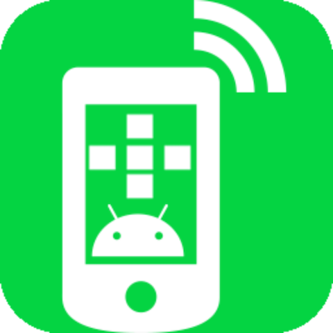
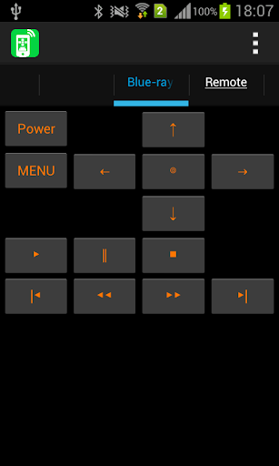
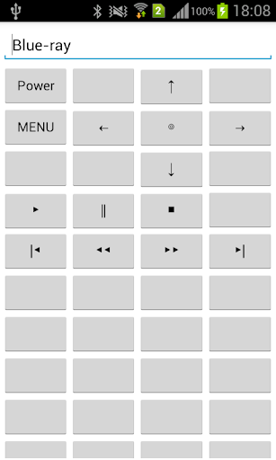

# Web Remote (HTTP)

<p>

</p>

Web Remote sends the characters in HTTP protocol

<p>
<a href="https://play.google.com/store/apps/details?id=com.jojoagogogo.wr">

</a>

<a href="https://github.com/jojoagogogo/webremote/releases/latest/download/webremote.apk">

</a>

</p>

<p>



</p>

## Web Remote (HTTP)

```
Web Remote sends the characters in HTTP protocol

[ Usage ]
* Button on the 4x10 are free to customize it is possible to assign Send Code
* Export / import Settings

[Settings]
URL to be transmitted (http(s):// myserver)
Key of the query to be added to the URL ( default data=the value set to the button)
Basic authentication (option)
```

## Web リモコン(HTTP)

```
WebリモコンはHTTP プロトコルで文字を送信するアプリです

[できること]
* 4x10 のボタンを自由にカスタマイズしてボタンに送信する文字を割り当てることが出来ます
* 設定内容のエクスポート/インポート

[設定項目]
送信対象のURL(http://myserver)
URLに付加するクエリのキー（デフォルトdata=ボタンに設定した値）
Basic認証（設定が無ければ送信しません）
```
